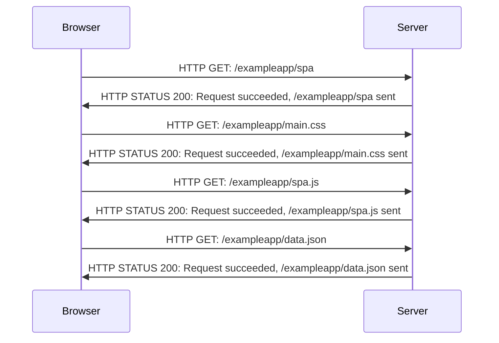

```mermaid
sequenceDiagram
Browser->>Server: HTTP GET:  /exampleapp/spa
Server->>Browser: HTTP STATUS 200: Request succeeded, /exampleapp/spa sent
Browser->>Server: HTTP GET: /exampleapp/main.css
Server->>Browser: HTTP STATUS 200: Request succeeded, /exampleapp/main.css sent
Browser->>Server: HTTP GET: /exampleapp/spa.js
Server->>Browser: HTTP STATUS 200: Request succeeded, /exampleapp/spa.js sent
Browser->>Server: HTTP GET: /exampleapp/data.json
Server->>Browser: HTTP STATUS 200: Request succeeded, /exampleapp/data.json sent
```